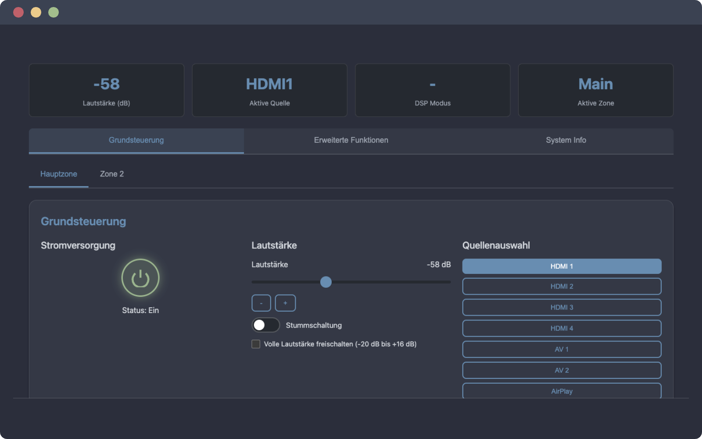

# 🎛️ Yamaha RX-V577 Controller

Eine professionelle Web-Anwendung zur vollständigen Steuerung des Yamaha RX-V577 AV-Receivers mit erweiterten Funktionen und modernem Dark Theme Interface.

> **Hinweis**: Dieses Projekt trägt bewusst nicht den offiziellen "Yamaha"-Markennamen im Projektverzeichnis oder Code, um lizenzrechtliche Konflikte zu vermeiden. Es handelt sich um eine inoffizielle, Open-Source-Implementierung für den persönlichen Gebrauch.




## Features

### 📱 **Navigation & Interface**
- **3 Main Tabs**: Grundsteuerung (Basic), Erweiterte Funktionen (Extended), System Info
- **Multi-Zone Control**: Hauptzone und Zone 2 mit separaten Einstellungen
- **Modern Dark Theme**: Professionelles dunkles UI mit CSS-Variablen
- **Responsive Design**: Optimiert für Desktop, Tablet und Mobile
- **PWA-Ready**: Progressive Web App mit Offline-Funktionalität
- **German Localization**: Vollständig deutsche Benutzeroberfläche

### 🔊 **Audio-Steuerung**
- **Power Control**: Ein/Aus mit visuellem Status-Indikator
- **Volume Control**: -80 dB bis -20 dB (erweitert bis +16 dB)
- **Volume Buttons**: Feineinstellung mit +/- Tasten
- **Mute Toggle**: Audio stumm/laut mit visueller Rückmeldung
- **Extended Volume Mode**: Freischaltung des vollen Lautstärkebereichs

### 📺 **Quellenauswahl**
- **HDMI Inputs**: HDMI 1, 2, 3, 4
- **Analog Inputs**: AV 1, AV 2
- **Digital Sources**: AirPlay, Server
- **Active Source Display**: Visuelle Anzeige der aktiven Quelle

### 🎵 **DSP & Surround Sound**
- **15 DSP Programme**:
  - Straight (Ohne DSP), Surround Decoder
  - Movie, Music, Game
  - Concert Hall, Jazz Club, Rock Concert
  - Stadium, Church, Chamber
  - Drama, Action Game, RPG, Sports
- **Dialogue Level**: Sprachverständlichkeit (-6 bis +6 dB)
- **Live DSP Display**: Anzeige des aktiven Modus

### 🎛️ **7-Band Equalizer**
- **Frequenzbänder**: 63Hz, 160Hz, 400Hz, 1kHz, 2.5kHz, 6.3kHz, 16kHz
- **Einstellbereich**: -6 bis +6 dB pro Band
- **EQ Reset**: Ein-Klick Zurücksetzen auf neutralen Klang
- **Live Preview**: Sofortige Anzeige der Einstellungen

### 🔧 **Erweiterte Audio-Features**
- **Extra Bass**: Verstärkte Basswidergabe
- **Bass/Treble Control**: -6 bis +6 dB Einstellung
- **Compressed Music Enhancer**: Verbesserung komprimierter Audiodateien
- **Pure Direct Mode**: Umgehung der Tonschaltungen
- **Straight Mode**: Direkte Signalverarbeitung
- **Virtual Presence Speaker (VPS)**: Virtueller Surround-Effekt

### 🏠 **Lautsprecher-Konfiguration** (YPAO-gesteuert, Anzeige-only)
- **Subwoofer Level**: Aktuelle YPAO-Einstellung
- **Center Speaker Level**: Center-Lautsprecher Pegel
- **Surround Level**: Surround-Lautsprecher Pegel
- **Dynamic Range Control (DRC)**: Status-Anzeige
- **Lip Sync Delay**: Audio-Verzögerung (YPAO-optimiert)

### 🎬 **Szenen-Steuerung**
- **4 Szenen-Presets**: Schnellzugriff auf gespeicherte Konfigurationen
- **Scene Activation**: Ein-Klick Szenen-Wechsel
- **Custom Configurations**: Persönliche Einstellungen speichern

### 📱 **HDMI-Einstellungen**
- **Audio Format**: PCM, DTS, Dolby Digital, Bitstream
- **HDMI Control**: Ein/Aus für HDMI-CEC Steuerung

### ⏰ **Sleep Timer**
- **Timer-Optionen**: Aus, 30, 60, 90, 120 Minuten
- **Automatisches Ausschalten**: Programmierbare Abschaltung

### 🎯 **Quick Setup Presets**
- **Movie Mode**: Optimiert für Kinoerlebnis
- **Music Mode**: Verbessert für Musikwiedergabe
- **Gaming Mode**: Angepasst für Gaming-Audio
- **Preset Save/Load**: Benutzerdefinierte Konfigurationen

### 📊 **System-Informationen**
- **Firmware Version**: Aktuelle System-Firmware
- **Gerätetemperatur**: Interne Temperaturüberwachung
- **Signal Format**: Aktuelle Signalinformationen
- **Kanal-Konfiguration**: Aktive Kanal-Anzeige
- **Netzwerk-Details**: IP, MAC, Gateway, Signalstärke

### 🌐 **Verbindungsmanagement**
- **IP-Konfiguration**: Manuelle Receiver-IP Einstellung
- **Connection Status**: Echtzeit-Verbindungsüberwachung
- **Auto-Connect**: Automatische Wiederverbindung beim Start
- **Connection Panel Toggle**: Einklappbare Verbindungssteuerung
- **Real-Time Polling**: 5-Sekunden Status-Updates

## Installation & Setup

### Automatische Installation mit PM2 (Empfohlen)

```bash
# Repository klonen
git clone https://github.com/yourusername/yamaha-rx-v577-controller.git
cd yamaha-rx-v577-controller

# Dependencies installieren
npm install

# PM2 Process starten
pm2 start server.js --name yamaha-controller

# PM2 Auto-Start aktivieren
pm2 startup
pm2 save
```

### Manuelle Installation

1. **Dependencies installieren**:
   ```bash
   npm install
   ```

2. **Server starten**:
   ```bash
   npm start
   ```

3. **Anwendung öffnen**:
   - Browser: `http://localhost:5001`
   - Netzwerk: `http://[RaspberryPI-IP]:5001`

4. **Receiver IP-Adresse finden**:
   - Router Admin-Panel für verbundene Geräte überprüfen
   - Nach "Yamaha" oder "RX-V577" in der Geräteliste suchen
   - Oder das Netzwerk-Menü des Receivers für die IP-Anzeige nutzen

5. **Mit Receiver verbinden**:
   - Receiver IP-Adresse im Verbindungspanel eingeben
   - "Verbinden" klicken um die Verbindung herzustellen
   - Die IP-Adresse wird in `receiver-config.json` für zukünftige Nutzung gespeichert

### Alternative: Direkter Browser-Zugriff (Mögliche CORS-Probleme)

1. **Direkter Zugriff**:
   - `index.html` im Webbrowser öffnen
   - Keine Installation erforderlich, aber möglicherweise CORS-Einschränkungen

2. **Bei CORS-Problemen**:
   - Node.js Server-Methode verwenden (empfohlen)
   - Oder lokalen Webserver starten: `python -m http.server 8000`

## Projektstruktur

```
yamaha-rx-v577-controller/
├── public/                 # Statische Assets
│   ├── assets/            # Bilder und andere Assets
│   │   ├── yahama-mockup-1.png    # Mockup-Bild 1
│   │   └── yamaha-mockup-2.png    # Mockup-Bild 2
│   ├── favicon.ico        # Website Icon
│   ├── favicon-16x16.png  # 16x16 Favicon
│   ├── favicon-32x32.png  # 32x32 Favicon
│   ├── apple-touch-icon.png       # iOS App Icon
│   ├── android-chrome-192x192.png # Android App Icon (192x192)
│   └── android-chrome-512x512.png # Android App Icon (512x512)
├── index.html              # Haupt-Interface mit Advanced Controls
├── server.js               # Express.js Server mit CORS Proxy
├── package.json            # Node.js Dependencies
├── receiver-config.json    # Gespeicherte Receiver-IP-Adresse (gitignore)
├── deploy-raspi.sh         # Deployment-Script für Raspberry Pi
├── .gitignore             # Git Ignore-Regeln
└── README.md              # Diese Dokumentation
```

## Technische Spezifikationen

- **Server**: Node.js mit Express.js
- **Dependencies**: Express, CORS, HTTP-Proxy-Middleware
- **Port**: 5001 (Standard)
- **Netzwerk**: Läuft auf 0.0.0.0 für Netzwerkzugriff
- **Process Manager**: PM2 für Produktionsumgebung
- **Interface**: Single Page Application mit Dark Theme
- **Config**: Automatische IP-Speicherung in JSON-Datei

## Verwendung

### Erste Verbindung
1. Receiver IP-Adresse eingeben (z.B. `192.168.1.100`)
2. "Verbinden" klicken - der Status-Indikator zeigt "Verbunden" bei Erfolg
3. Steuerelemente erscheinen nach erfolgreicher Verbindung

### Stromversorgung
- Den runden Power-Button zum Ein-/Ausschalten klicken
- Status zeigt aktuellen Zustand (Ein/Standby)

### Lautstärke-Steuerung
- Lautstärke-Regler für Pegelanpassung verwenden (-80 dB bis +16 dB)
- +/- Buttons für präzise Einstellungen
- "Stummschaltung" zum Umschalten des Stummzustands

### Quellenauswahl
- Beliebige Eingangstaste klicken um Quelle zu wechseln
- Aktive Quelle ist blau hervorgehoben
- Unterstützt HDMI, AV, Audio, AirPlay, Server, USB und Tuner-Eingänge

### Zonen-Steuerung
- Zwischen Hauptzone und Zone 2 mit den Tabs wechseln
- Jede Zone hat unabhängige Steuerung

### Szenen-Auswahl
- Szene 1-4 Buttons klicken um vorkonfigurierte Einstellungen zu aktivieren
- Szenen kombinieren Quellenauswahl und DSP-Einstellungen

## Unterstützte Receiver

Diese Anwendung ist für den Yamaha RX-V577 entwickelt, sollte aber auch mit anderen Yamaha-Receivern funktionieren, die das XML-Steuerungsprotokoll unterstützen:

- RX-V Serie (RX-V473, RX-V573, RX-V673, RX-V773)
- HTR Serie mit Netzwerkfähigkeit
- Andere netzwerkfähige Yamaha AV-Receiver

## Technische Details

### XML-Befehle
Die Anwendung verwendet Yamahas XML-Steuerungsprotokoll über HTTP POST-Anfragen an `/YamahaRemoteControl/ctrl`.

Beispiel-Befehle:
```xml
<!-- Power On -->
<YAMAHA_AV cmd="PUT"><Main_Zone><Power_Control><Power>On</Power></Power_Control></Main_Zone></YAMAHA_AV>

<!-- Volume Set -->
<YAMAHA_AV cmd="PUT"><Main_Zone><Volume><Lvl><Val>-200</Val><Exp>1</Exp><Unit>dB</Unit></Lvl></Volume></Main_Zone></YAMAHA_AV>

<!-- Input Select -->
<YAMAHA_AV cmd="PUT"><Main_Zone><Input><Input_Sel>HDMI1</Input_Sel></Input></Main_Zone></YAMAHA_AV>

<!-- Get Status -->
<YAMAHA_AV cmd="GET"><Main_Zone><Basic_Status>GetParam</Basic_Status></Main_Zone></YAMAHA_AV>
```

### Netzwerk-Anforderungen
- Receiver und steuerndes Gerät müssen im selben Netzwerk sein
- HTTP-Anfragen an Receiver IP-Adresse auf Port 80
- Keine Authentifizierung für lokalen Netzwerkzugriff erforderlich

## Problembehandlung

### Verbindungsprobleme
- **"Verbindung fehlgeschlagen"**: IP-Adresse auf Korrektheit überprüfen
- **"Netzwerkfehler - CORS-Einstellungen prüfen"**: 
  - Moderne Browser blockieren möglicherweise Cross-Origin-Anfragen
  - Lokalen Webserver oder Proxy verwenden
  - Manche Browser funktionieren besser für lokale Netzwerkanfragen

### Einschaltprobleme
- **Einschalten funktioniert nicht**: 
  - RX-V577 reagiert möglicherweise nicht auf Netzwerkbefehle im Standby über Wi-Fi
  - Ethernet-Verbindung für zuverlässigeres Einschalten verwenden
  - Physischer Power-Button oder IR-Fernbedienung für erstes Einschalten nötig

### Status wird nicht aktualisiert
- Netzwerkverbindung überprüfen
- Sicherstellen, dass Receiver eingeschaltet ist
- Status-Polling erfolgt automatisch alle 5 Sekunden

## CORS und Sicherheit

Aufgrund von Browser-Sicherheitsbeschränkungen können CORS (Cross-Origin Resource Sharing) Probleme bei Anfragen an den Receiver auftreten. Lösungen:

1. **Lokalen Webserver verwenden**:
   ```bash
   # Python 3
   python -m http.server 8000
   
   # Node.js
   npx http-server
   ```

2. **Browser-Flags** (nur zum Testen):
   - Chrome: `--disable-web-security --user-data-dir=/tmp/chrome_dev`
   - Nicht für reguläre Nutzung empfohlen

3. **Proxy-Setup**: Lokalen Proxy konfigurieren um Anfragen an Receiver weiterzuleiten

## Browser-Kompatibilität

- Chrome/Chromium: Beste Kompatibilität
- Firefox: Gute Kompatibilität
- Safari: Eingeschränkt durch strengere CORS-Richtlinien
- Edge: Gute Kompatibilität

## PM2 Verwaltung

```bash
# Status anzeigen
pm2 status

# Logs anzeigen
pm2 logs yamaha-controller

# Neustart
pm2 restart yamaha-controller

# Stoppen
pm2 stop yamaha-controller

# Entfernen
pm2 delete yamaha-controller
```

## Raspberry Pi Bereitstellung

Das Projekt läuft optimal auf einem Raspberry Pi als dedizierter RX-V577 Controller:

1. **Raspberry Pi OS** mit Node.js und PM2
2. **Netzwerkzugriff** über lokale IP-Adresse
3. **Auto-Start** beim Systemstart durch PM2
4. **Log-Management** durch PM2 integriert

## Lizenz

Martin Pfeffer 2025 Berlin, Lizenz MIT

Yamaha und RX-V577 sind Markenzeichen der Yamaha Corporation.