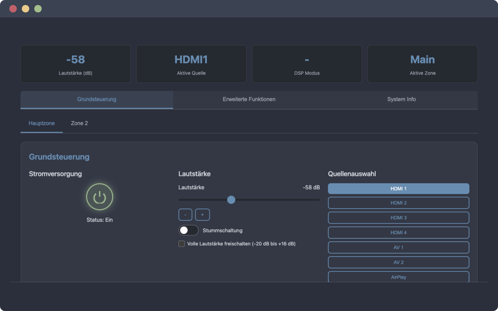
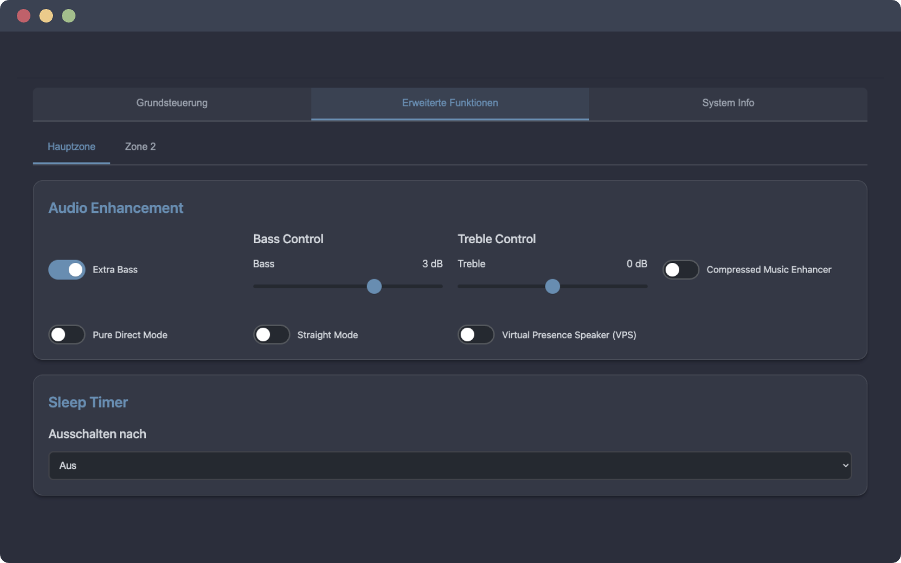

# 🎛️ Yamaha RX-V577 Controller

> **Stack note (2026-06):** This app was migrated from **Node.js/Express + PM2** to a single
> **Go binary running under systemd**. There is **no** `package.json`, `server.js`,
> `ecosystem.config.js`, `npm`, or PM2 anymore — see [Technical Details](#-technical-details).

<div align="center">


<!-- GitHub meta -->


<!-- Stack -->


<!-- Device & protocol -->


<!-- Platform & deployment -->


<!-- Quality & project health -->


<h3>Web Application for Complete Control of Yamaha RX-V577 AV Receivers</h3>

<p>
  <strong>A modern, feature-rich PWA — Material Design 3 Expressive UI with dark/light theme</strong>
</p>





</div>

---

## 💖 Support This Project

<div align="center">

If you find this project useful, consider supporting its development:

[](https://www.paypal.com/donate/?hosted_button_id=YOUR_BUTTON_ID)

<sub>Your support helps maintain and improve this project. Every contribution, no matter how small, is greatly appreciated! ❤️</sub>

</div>

---

## 📋 Table of Contents

- [How It Works](#-how-it-works)
- [Features](#-features)
- [Quick Start](#-quick-start)
- [Build & Deploy](#-build--deploy)
- [Usage](#-usage)
- [Technical Details](#-technical-details)
- [API Documentation](#-api-documentation)
- [Troubleshooting](#-troubleshooting)
- [Tests](#-tests)
- [Contributing](#-contributing)
- [License](#-license)

## 🧭 How It Works

The backend is a tiny, self-contained **Go binary** (`yamaha-controller`, ARM64, ~6.3 MB). It does three things:

1. **Serves the PWA** — `index.html` plus the static assets in `public/` (icons, manifest, service worker).
2. **Exposes two small control endpoints** — `GET /api/health` and `POST /api/set-receiver-ip`.
3. **Reverse-proxies `/api/receiver/*`** to the configured Yamaha receiver's HTTP API, so the
   browser talks to the receiver through the app (no CORS issues, runtime-configurable target IP).

The receiver IP is stored in `receiver-config.json` and is settable at runtime via the UI / the
`/api/set-receiver-ip` endpoint — no rebuild or restart required.

## ✨ Features

### 📱 Navigation & Interface
- **Material Design 3 Expressive UI** with spring animations + circular theme-reveal (View Transitions API)
- **Multi-Tab Interface**: Basic controls, extended features, and system information
- **Multi-Zone Control**: Independent control for Main Zone and Zone 2
- **Dual Theme Support**: Dark theme (default) and light theme with one-click toggle
- **Progressive Web App**: Installable on mobile devices with offline functionality (service worker)
- **Responsive Design**: Optimized for desktop, tablet, and mobile devices
- **Real-time Updates**: Status polling every 5 seconds for live updates

### 🔊 Audio Control
- **Volume Management**: -80 dB to +16 dB range with fine adjustment buttons
- **Power Control**: On/Off with visual status indicators
- **Mute Toggle**: Quick audio muting with visual feedback
- **Extended Volume Mode**: Unlock full volume range capabilities

### 📺 Input Selection
- **HDMI Inputs**: HDMI 1-4 support
- **Analog Inputs**: AV 1-2 channels
- **Digital Sources**: AirPlay, Server, USB, Tuner
- **Active Source Display**: Visual highlighting of current input

### 🎵 DSP & Surround Sound
- **15 DSP Programs**: Including Straight, Surround Decoder, Movie, Music, Game modes
- **Environment Simulations**: Concert Hall, Jazz Club, Rock Concert, Stadium, Church
- **Gaming Modes**: Action Game, RPG, Sports optimizations
- **Dialogue Enhancement**: -6 to +6 dB adjustment for voice clarity

### 🎛️ Advanced Audio Features
- **7-Band Equalizer**: 63Hz, 160Hz, 400Hz, 1kHz, 2.5kHz, 6.3kHz, 16kHz
- **Bass/Treble Control**: -6 to +6 dB adjustment
- **Extra Bass**: Enhanced bass reproduction
- **Compressed Music Enhancer**: Improve compressed audio quality
- **Pure Direct Mode**: Bypass tone circuits for purest sound
- **Virtual Presence Speaker**: Virtual surround effect

### 🏠 Speaker Configuration
- **YPAO Integration**: Display YPAO-calibrated settings
- **Subwoofer Level**: Current YPAO settings display
- **Center/Surround Levels**: Individual speaker level monitoring
- **Dynamic Range Control**: DRC status display
- **Lip Sync Delay**: YPAO-optimized audio delay

### 🎬 Scene Control
- **4 Scene Presets**: Quick access to saved configurations
- **One-Click Activation**: Instant scene switching
- **Custom Configurations**: Save personal settings

### 📊 System Information
- **Firmware Version**: Current system firmware display
- **Temperature Monitoring**: Internal temperature tracking
- **Signal Format**: Active signal information
- **Channel Configuration**: Active channel display
- **Network Details**: IP, MAC, Gateway, signal strength

## 🚀 Quick Start

Run the Go binary directly (anywhere on the same network as the receiver):

```bash
# Clone the repository
git clone https://github.com/pepperonas/yahama-controller.git
cd yahama-controller

# Build the binary (Go 1.26+)
go build -o yamaha-controller .

# Run it (serves on port 5001; set PORT to override)
./yamaha-controller

# Access the application
# Browser: http://localhost:5001
# Network: http://[YOUR-IP]:5001
```

The server reads/writes `receiver-config.json` in its working directory; set the receiver IP from
the UI's connection panel on first launch.

**Environment variables**

| Variable      | Default            | Purpose                                          |
|---------------|--------------------|--------------------------------------------------|
| `PORT`        | `5001`             | HTTP listen port                                 |
| `YAMAHA_DIR`  | current dir        | Base dir for `index.html`, `public/`, config     |

## 📦 Build & Deploy

### Prerequisites
- **Go 1.26+** (to build) — no Node.js, no npm
- Network access to your Yamaha receiver

### Production deployment (Raspberry Pi, systemd)

The reference deployment is a cross-compiled ARM64 binary running as a **systemd** service on a
Raspberry Pi.

```bash
# 1. Cross-build for ARM64 (e.g. from a dev machine)
GOOS=linux GOARCH=arm64 go build -ldflags "-s -w" -o bin/yamaha-controller-arm64 .

# 2. Copy the binary to the Pi
scp bin/yamaha-controller-arm64 pi@<pi-host>:/home/pi/apps/yahama-controller/yamaha-controller

# 3. Restart the service
ssh pi@<pi-host> 'sudo systemctl restart yamaha-controller'
```

The systemd unit (`yamaha-controller.service`):

```ini
[Unit]
Description=Yamaha Receiver Control (Go) — RX-V577 proxy + PWA
After=network-online.target
Wants=network-online.target

[Service]
Type=simple
User=pi
WorkingDirectory=/home/pi/apps/yahama-controller
ExecStart=/home/pi/apps/yahama-controller/yamaha-controller
Restart=on-failure
RestartSec=3

[Install]
WantedBy=multi-user.target
```

Install / enable it once:

```bash
sudo cp yamaha-controller.service /etc/systemd/system/
sudo systemctl daemon-reload
sudo systemctl enable --now yamaha-controller

# Logs
sudo journalctl -u yamaha-controller -f
```

## 🎮 Usage

### Initial Setup

1. **Find Your Receiver's IP Address**:
   - Check your router's admin panel for connected devices
   - Look for "Yamaha" or "RX-V577" in the device list
   - Or use the receiver's network menu to display IP

2. **Connect to Receiver**:
   - Enter the receiver's IP address in the connection panel
   - Click "Connect" to establish connection
   - The IP is persisted in `receiver-config.json` for future sessions

### Basic Operations

#### Power Control
- Click the round power button to toggle on/off
- Status indicator shows current state (On/Standby)

#### Volume Control
- Use the volume slider for adjustment (-80 dB to +16 dB)
- Click +/- buttons for precise changes
- Toggle mute for quick silence

#### Input Selection
- Click any input button to switch sources
- Active source is highlighted in blue
- Supports HDMI, AV, Audio, AirPlay, Server, USB, and Tuner inputs

#### Zone Control
- Switch between Main Zone and Zone 2 using tabs
- Each zone has independent controls

#### Scene Selection
- Click Scene 1-4 buttons to activate preconfigured settings
- Scenes combine input selection and DSP settings

## 🔧 Technical Details

### Architecture

```
yahama-controller/
├── main.go                 # Go server: PWA static serving + /api/* + receiver reverse-proxy
├── go.mod                  # Go module (no external deps — stdlib only)
├── yamaha-controller       # Compiled ARM64 binary (deployed artifact)
├── yamaha-controller.service  # systemd unit
├── index.html              # Main interface (PWA shell)
├── public/                 # Static assets
│   ├── assets/             # Images and mockups
│   ├── icon-*.png / favicon* / apple-touch-icon.png  # App icons
│   ├── manifest.json       # PWA manifest
│   └── service-worker.js   # Offline functionality
└── receiver-config.json    # Saved receiver IP (written at runtime)
```

### Technology Stack

- **Backend**: **Go** (standard library only — `net/http` + `net/http/httputil` reverse proxy)
- **Runtime**: single static binary, **no dependencies**, run under **systemd**
- **Frontend**: Vanilla JavaScript / HTML5 / CSS3, Material Design 3 Expressive theming
- **Communication**: XML-based Yamaha protocol over HTTP, reverse-proxied by the Go backend
- **Distribution**: cross-compiled ARM64 binary for Raspberry Pi

### Network Requirements

- Receiver and controller must be on the same network
- The backend makes HTTP requests to the receiver IP on port 80
- No authentication required for local network access
- CORS is handled by the Go server (permissive `Access-Control-Allow-*` headers + the
  `/api/receiver/*` reverse proxy)

## 📚 API Documentation

### Server Endpoints (Go backend)

| Method | Path                     | Purpose                                                        |
|--------|--------------------------|----------------------------------------------------------------|
| `GET`  | `/`                      | Serve the PWA (`index.html` + `public/` assets)                |
| `GET`  | `/api/health`            | Health check — returns `{status, receiverIP, timestamp}`       |
| `POST` | `/api/set-receiver-ip`   | Set + persist the receiver IP (`{"ip":"192.168.x.y"}`)         |
| `*`    | `/api/receiver/*`        | Reverse-proxy to `http://<receiverIP>/*` (prefix stripped)     |

All endpoints respond to `OPTIONS` for CORS preflight.

### XML Command Structure (Yamaha protocol)

Commands are sent to the receiver through the `/api/receiver/*` proxy. Examples:

```xml
<!-- Power Control -->
<YAMAHA_AV cmd="PUT">
  <Main_Zone>
    <Power_Control>
      <Power>On</Power>
    </Power_Control>
  </Main_Zone>
</YAMAHA_AV>

<!-- Volume Adjustment -->
<YAMAHA_AV cmd="PUT">
  <Main_Zone>
    <Volume>
      <Lvl>
        <Val>-200</Val>
        <Exp>1</Exp>
        <Unit>dB</Unit>
      </Lvl>
    </Volume>
  </Main_Zone>
</YAMAHA_AV>

<!-- Input Selection -->
<YAMAHA_AV cmd="PUT">
  <Main_Zone>
    <Input>
      <Input_Sel>HDMI1</Input_Sel>
    </Input>
  </Main_Zone>
</YAMAHA_AV>

<!-- Status Query -->
<YAMAHA_AV cmd="GET">
  <Main_Zone>
    <Basic_Status>GetParam</Basic_Status>
  </Main_Zone>
</YAMAHA_AV>
```

## 🐛 Troubleshooting

### Connection Issues

**Problem**: "Connection failed" error
- Verify the receiver IP address is correct (check `/api/health` → `receiverIP`)
- Ensure the receiver is powered on and network-connected
- Check firewall settings aren't blocking connections

**Problem**: Cannot power on via network
- RX-V577 may not respond to network commands in standby over Wi-Fi
- Use Ethernet connection for reliable network wake
- Physical power button or IR remote may be needed for initial power-on

### Service / Status Issues

```bash
# Is the service running?
systemctl status yamaha-controller

# Follow logs
sudo journalctl -u yamaha-controller -f

# Restart after deploying a new binary
sudo systemctl restart yamaha-controller
```

- Status polling occurs every 5 seconds automatically
- Check the browser console for client-side error messages

## 🧪 Tests

The project ships comprehensive Go unit tests across two files — `main_test.go` (HTTP server logic)
and `yamaha_test.go` (pure Yamaha-protocol helpers) — totalling **49 test functions**.

```bash
go test ./...
```

```
ok  yamaha-controller  0.36s
```

Run with verbose output to see all 49 test names:

```bash
go test ./... -v
```

**What's tested:**

| Area | File | Tests |
|---|---|---|
| **IP regex validation** | `main_test.go` | 7 valid IPv4 addresses pass · 10 malformed/out-of-range/non-IP strings rejected |
| **Config persistence** | `main_test.go` | Round-trip `saveConfig` → `loadConfig` · missing file leaves state unchanged · corrupt JSON leaves state unchanged · written file is valid JSON |
| **`GET /api/health`** | `main_test.go` | Returns 200 + `application/json` · body contains `status:"OK"`, `receiverIP`, and `timestamp` |
| **`POST /api/set-receiver-ip`** | `main_test.go` | Valid IP → 200 + `{success:true}` + in-memory state updated · bad format / empty / hostname → 400 · malformed JSON → 400 |
| **CORS middleware** | `main_test.go` | `Access-Control-Allow-Origin: *` present · `OPTIONS` preflight returns 204 |
| **Static file serving** | `main_test.go` | Path-traversal (`/../etc/passwd`) blocked · `/` returns `index.html` · missing path returns 404 |
| **Receiver proxy** | `main_test.go` | No IP configured → 500 with `error` field |
| **Volume conversion** | `yamaha_test.go` | `DBtoRaw` / `RawToDB` common values, rounding, clamping, and full round-trip at 7 dB points |
| **Percentage ↔ dB** | `yamaha_test.go` | `DBtoPct` / `PctToDB` endpoints, midpoint, clamping, and round-trip at 5 percentage points |
| **ClampDB** | `yamaha_test.go` | Clamps to −80.0 / +16.5 dB range at min, max, below, and above |
| **Tone control** | `yamaha_test.go` | `ToneDBtoRaw` / `ToneRawtoDB` common values + clamping to ±6.0 dB |
| **XML builders** | `yamaha_test.go` | `PutXML` / `GetXML` envelope structure · `PowerXML` On/Standby · `VolumeXML` Val/Exp/Unit · `MuteXML` On/Off · `InputXML` · `BassXML` · `TrebleXML` · `BasicStatusGetXML` · Zone 2 tag |
| **Volume XML round-trip** | `yamaha_test.go` | dB → `DBtoRaw` → `VolumeXML` contains correct `<Val>` at 4 dB points |
| **Input source mapping** | `yamaha_test.go` | All 16 known inputs recognised · case-insensitive matching · 8 invalid/unknown inputs rejected |
| **Proxy path stripping** | `yamaha_test.go` | 5 path cases: bare prefix, trailing slash, deep path, unmatched prefix |

## 🤝 Contributing

Contributions are welcome! Please feel free to submit a Pull Request.

1. Fork the repository
2. Create your feature branch (`git checkout -b feature/AmazingFeature`)
3. Commit your changes (`git commit -m 'Add some AmazingFeature'`)
4. Push to the branch (`git push origin feature/AmazingFeature`)
5. Open a Pull Request

### Development Setup

```bash
# Build
go build -o yamaha-controller .

# Run locally (auto-creates / reads receiver-config.json in the working dir)
./yamaha-controller

# Vet
go vet ./...
```

## 📄 License

MIT License - Copyright (c) 2025 Martin Pfeffer

This project is licensed under the MIT License - see the [LICENSE](LICENSE) file for details.

Yamaha and RX-V577 are trademarks of Yamaha Corporation. This is an unofficial, open-source implementation for personal use.

---

<div align="center">
  <sub>Built with ❤️ in Berlin</sub>
</div>
